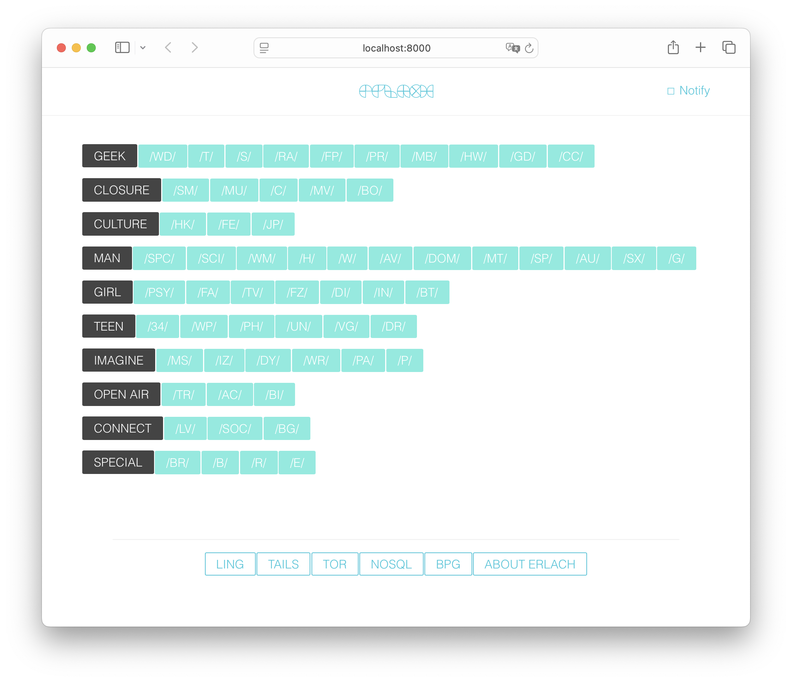

# Erlach
**Fully anonymous imageboard and anonymous comments service**

## Overview

* Erlach – Anonymous imageboard as SPA on the WebSockets and supports BPG images.
* Web site: [erlach.co](https://erlach.co/)
* Tor network: [http://erlachx4ahxagauop5zczffrn2dlqfagcfxyvksbgxus2ktn2kxywpad.onion/](http://erlachx4ahxagauop5zczffrn2dlqfagcfxyvksbgxus2ktn2kxywpad.onion/)


## Features

* Completely anonymous without personalization
* [BPG](https://bellard.org/bpg/) images
* Smart posting
* Canvas rendering
* Single page application (SPA)
* [WebSocket](https://www.rfc-editor.org/rfc/rfc6455.html) transport




## Requirements

* Unix
* [Erlang/OTP 18](https://github.com/kerl/kerl?tab=readme-ov-file#using-kerl)
* libjpeg-progs (`apt-get install libjpeg-progs`)
* [ImageMagick](https://imagemagick.org/)
* [libbpg](https://bellard.org/bpg/)
* inotify-tools (optional for live code reload)

## Run Erlach

1. Srart attached docker container
```sh
docker pull erlang:18.3.3
docker run --rm -it -p 8000:8000 -v "$(pwd)":/app -w /app erlang:18.3.3 bash
```
2. Setup Git configuration into docker container and start Erlang app with REPL mode
```sh
git config --system url."https://github.com/".insteadOf git://github.com/
```

3. Patch `ux` library
```sh
sed -i '314s|-spec freq(string()) -> dict().|-spec freq(string()) -> dict:dict().|' deps/ux/src/ux_string.erl
sed -i '21s|key2server :: dict()|key2server :: dict:dict()|' deps/ux/src/unidata/ux_unidata_filelist.erl 
```

4. Get dependencies, compile and run Erlach with [mad](https://github.com/synrc/mad/tree/1.9)
```sh
./mad deps compile repl
```

4. Init Erlach database into ERTS terminal
```erlang
erlach_db:init().
```

5. Open URL [http://localhost:8000/](http://localhost:8000/) on host system


## Feedback

* Twitter [@erlach_co](https://twitter.com/erlach_co)
* On errors make as issue in this repository

## Credits
* [Namdak Tonpa](https://github.com/5HT/)
